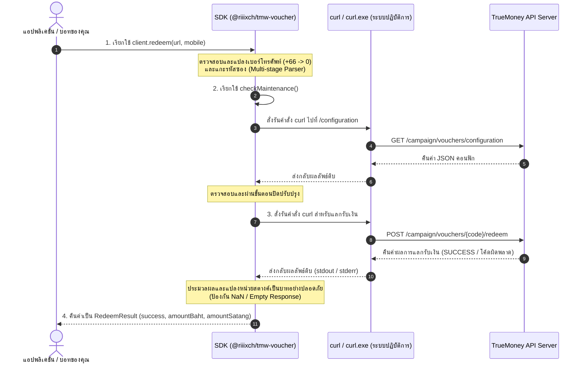

# 🇹🇭 @riiixch/tmw-voucher 🧧

[](https://www.npmjs.com/package/@riiixch/tmw-voucher)
[](https://github.com/riiixch/tmw-voucher/actions/workflows/ci.yml)
[](LICENSE)
[](https://www.typescriptlang.org)
[](#)
[](https://github.com/riiixch)

> **เครื่องมือและไลบรารีภาษา JavaScript/TypeScript คุณภาพสูงสำหรับกดรับซองอั่งเปา (Gift Voucher) ของ TrueMoney Wallet โดยอัตโนมัติ ออกแบบมาให้มีความทนทานและปลอดภัยสูงสุด พร้อมระบบหลบเลี่ยง Cloudflare TLS Fingerprint โดยใช้ `curl` เป็นค่าเริ่มต้น และรองรับการดักจับข้อผิดพลาดระดับ Enterprise-grade สำหรับ TypeScript & Node.js**
>
> 🔗 **สมัครใช้งานและเป็นเจ้าของแพ็กเกจได้ที่:** [NPM Registry Official Website](https://www.npmjs.com/package/@riiixch/tmw-voucher)

---

## 💡 แก้ไขปัญหาอะไร? (What Problem Does This Solve?)

การเขียนโค้ดยิงกดรับซองอั่งเปาทรูมันนี่แบบเดิมๆ มักมีข้อจำกัดที่ทำให้นักพัฒนาติดขัดและบอทแครชอยู่ตลอดเวลา SDK ตัวนี้ได้รับการขัดเกลาและขจัดจุดอ่อนทั้งหมดเรียบร้อยแล้ว:

### 1️⃣ การบล็อก 403 Forbidden จาก Cloudflare TLS Fingerprint
- **ปัญหา**: TrueMoney วางหน้าแคมเปญแจกซองอั่งเปาไว้หลังระบบป้องกัน Cloudflare ทำให้การส่ง HTTPS Request ผ่านไคลเอนต์ทั่วไปใน Node.js (เช่น `axios` หรือ `fetch`) จะถูกตรวจจับลายนิ้วมือ TLS (TLS Fingerprint) และส่งผลลัพธ์ปฏิเสธกลับมาเป็น 403 Forbidden เสมอ
- **วิธีแก้**: SDK นี้แก้ปัญหาโดยใช้โมดูล **Schannel / curl native bridge** เป็นตัวส่งสัญญาณ HTTP เริ่มต้น ยิงข้อมูลโดยตรงผ่านระบบปฏิบัติการ ทำให้ Cloudflare ตรวจจับเป็นเบราว์เซอร์ปกติ บายพาสการบล็อกได้ 100%

### 2️⃣ ปัญหาเบอร์โทรศัพท์ขาเข้าที่ผิดรูปแบบ (Input Validation Errors)
- **ปัญหา**: เบอร์โทรศัพท์ของผู้รับเงินมักติดขีดแดช (`-`), ช่องว่าง, หรือส่งมาในรูปแบบรหัสสากล (เช่น `+66812345678` หรือ `66812345678`) ซึ่งหากส่งไปแบบดิบจะถูก TrueMoney ปฏิเสธ และหากปล่อยให้เกิดความผิดพลาดตอนรันไทม์จะเสียเวลาดีบั๊ก
- **วิธีแก้**: ระบบติดตั้งฟีเจอร์ **Early Constructor Validation & Normalization** ช่วยสแกนและตรวจสอบรูปแบบเบอร์ทันทีตั้งแต่ขั้นตอนสร้าง Instance (`new TmwVoucher`) พร้อมทำความสะอาดล้างอักขระพิเศษและแปลงรหัสสากล `+66` ให้เป็น `0` นำหน้าโดยอัตโนมัติแบบ DRY (เช่น `+66 81-234-5678` -> `0812345678`) หากไม่ถูกต้องจะโยน `TmwValidationError` ทันทีเพื่อปกป้องการแครชระหว่างรันไทม์

### 3️⃣ ความไม่เสถียรของ JSON Parser และข้อความแอปแครช (Parser Resilience)
- **ปัญหา**: เมื่อระบบของทรูมันนี่ขัดข้อง, เซิร์ฟเวอร์ปิดปรับปรุง, หรือเกิดเน็ตเวิร์กแล็ก การทำ `JSON.parse()` แบบดิบจากข้อมูลที่ตอบกลับมักทำให้แอปพลิเคชันหรือบอทหลักแครชลงมาดื้อๆ
- **วิธีแก้**: ระบบครอบคลุมสถาปัตยกรรม **Multi-stage try-catch** อย่างหนาแน่นในทุกข้อต่อ:
  - ทำการล้าง whitespace (trim) ผลตอบกลับก่อนพาร์ส
  - หากแปลง JSON ไม่สำเร็จ จะสกัดข้อความ HTML ดิบ 100 ตัวแรกส่งเป็นรายละเอียดข้อผิดพลาด
  - ดักตรวจสถานะ `status.code` และแปลงยอดเงินจากหน่วยสตางค์เป็นบาทอย่างแม่นยำ ป้องกันปัญหา `NaN` แบบถาวร

### 4️⃣ รูปแบบ URL ซองที่หลากหลาย (Multi-stage URL/Code Parser)
- **ปัญหา**: ผู้ใช้ส่งลิงก์ซองเข้ามาหลากแบบ บางคนส่งเฉพาะรหัสดิบ บางคนมีเศษเครื่องหมายแฮชหรือสแลชพ่วงมา (เช่น `5a1b2...#hash`) หรือลิงก์ไม่มีโปรโตคอล
- **วิธีแก้**: ติดตั้ง **Multi-stage parsing** ไล่เรียงตรวจสอบจาก API URL parameters -> Regex คัดกรอง -> และคัดเลือกกลุ่มอักขระ Alphanumeric ขนาด 10-48 ตัวอักษรกลุ่มแรกโดยอัตโนมัติ ดึงโค้ดออกมาได้อย่างไร้รอยต่อ

### 5️⃣ ความเปราะบางของระบบเครือข่ายและการเชื่อมต่อสัญญาณสะดุด (Network Resilience)
- **ปัญหา**: ในการเคลมซองอั่งเปาในระบบโปรดักชัน บางครั้งเครือข่ายอาจมีความล่าช้า สัญญาณหลุด หรือ TrueMoney API โหลดหนักและเกิดสัญญาณสะดุดเป็นครั้งคราว ส่งผลให้คำขอขาดตอน (Transient Errors)
- **วิธีแก้**: ติดตั้งระบบ **Automatic Retry & Exponential Backoff** แบบ Native โดยไม่ต้องมี Dependencies ภายนอก ระบบจะทำการลองใหม่อัตโนมัติในกรณีเน็ตเวิร์กขัดข้องหรือรัน curl ล้มเหลว พร้อมเพิ่มความหน่วงเวลาขึ้นเรื่อยๆ ทวีคูณแบบทวีคูณเพื่อความนุ่มนวลและป้องกันการยิงระเบิดเซิร์ฟเวอร์ (เช่น รอ 1s -> 2s -> 4s ก่อนยอมแพ้)

---

## 🌟 จุดเด่นของแพ็กเกจ (Key Features)

- **100% TypeScript & Strict Type Safety**: พัฒนาด้วย TypeScript ทุกบรรทัด มีการกู้คืน Prototype chain สำหรับ Custom Errors และ **ไม่มีการใช้ `any` เด็ดขาด** 🛡
- **Zero Core Dependencies**: ไร้แพ็กเกจภายนอกในระบบแกนหลัก (อาศัย Native OS `curl` และ Node built-ins) ทำให้บิลแพ็กเกจมีขนาดเล็ก ปราศจากช่องโหว่ความมั่นคงปลอดภัย
- **Dual Module Build (ESM & CJS)**: บิวด์สนับสนุนทั้ง `import` และ `require` ควบคู่กับไฟล์ประเภทข้อมูล `.d.ts` / `.d.cts` เต็มรูปแบบ
- **Granular try-catch protection**: ดักจับและคัดแยกคลาสข้อยกเว้นออกมาชัดเจน เช่น `TmwValidationError`, `TmwInvalidUrlError`, `TmwMaintenanceError`, และ `TmwNetworkError`

---

## 📊 ขั้นตอนการทำงานของระบบ (System Architecture & Flows)

แผนภาพแสดงขั้นตอนการทำงานและการส่งสัญญาณร้องขอเพื่อเคลมซองอั่งเปาระหว่างระบบของคุณและ TrueMoney Wallet API:



---

## 📦 การติดตั้ง (Installation)

```bash
npm install @riiixch/tmw-voucher
```

> [!WARNING]  
> **ข้อกำหนดเบื้องต้นของระบบปฏิบัติการ (Prerequisite):**
> สภาพแวดล้อมระบบคลาวด์หรือเซิร์ฟเวอร์ของคุณจำเป็นต้องมีเครื่องมือ `curl` (หรือ `curl.exe` บนระบบปฏิบัติการ Windows) ติดตั้งอยู่ในระดับ PATH เพื่อใช้ในการส่งสัญญาณคำขอหลบเลี่ยง Cloudflare TLS Block (Windows 10/11 และระบบปฏิบัติการ Linux ตระกูลหลักส่วนใหญ่จะติดตั้งมาให้เป็นดีฟอลต์เรียบร้อยแล้ว)

---

## 🚀 คู่มือการใช้งานทั่วไป (Basic Usage)

คุณสามารถเลือกใช้งานได้สองรูปแบบตามความต้องการของสถาปัตยกรรมระบบ:

### 1️⃣ วิธีเรียกใช้งานแบบ Class (แนะนำสำหรับการจัดการในภาพรวม)

```typescript
import { TmwVoucher } from '@riiixch/tmw-voucher';

// 1. กำหนดอินสแตนซ์พร้อมเบอร์โทร, เวลาหมดอายุ และระบบยิงซ้ำอัตโนมัติ (Retry & Backoff)
const redeemer = new TmwVoucher({
  mobile: '081-234-5678', // ระบบจะตรวจเช็คความถูกต้องและ Normalize ทันทีใน Constructor
  timeout: 15000,         // หมดเวลารอคอย 15 วินาที
  retryOptions: {
    retries: 3,           // หากเกิดปัญหาการเชื่อมต่อเครือข่าย จะพยายามกดยิงซ้ำสูงสุด 3 ครั้ง
    minTimeout: 1000,     // รอบแรกหน่วงเวลารอคอย 1 วินาทีก่อนลองใหม่
    factor: 2             // ทวีคูณเวลารอคอยเป็น 2 เท่าในรอบถัดไป (1s -> 2s -> 4s)
  }
});

async function run() {
  try {
    const voucherUrl = 'https://gift.truemoney.com/campaign/?v=5a1b2c3d4e5f6g7h8i9j0k';
    
    console.log('กำลังเคลมและกดรับซองอั่งเปา...');
    const result = await redeemer.redeem(voucherUrl);

    if (result.success) {
      console.log(`🎉 แลกรับซองสำเร็จ!`);
      console.log(`- ได้รับเงินโอน: ${result.amountBaht} บาท`);
      console.log(`- หน่วยจำนวนสตางค์: ${result.amountSatang} สตางค์`);
      console.log(`- รายละเอียด API: ${result.message}`);
    } else {
      console.error(`❌ รับเงินไม่สำเร็จ: [${result.code}] ${result.message}`);
    }
  } catch (error) {
    console.error('เกิดข้อผิดพลาดในการประมวลผลคำขอ:', error);
  }
}

run();
```

### 2️⃣ วิธีเรียกใช้งานแบบฟังก์ชันด่วน (Functional convenient wrapper)

หากไม่ต้องการบันทึกสถานะ Instance หรือปรับแต่งค่าเชิงลึก สามารถเรียกใช้ฟังก์ชันด่วน `redeemVoucher` ได้ทันที:

```typescript
import { redeemVoucher } from '@riiixch/tmw-voucher';

async function quickClaim() {
  // บังคับส่งเบอร์โทรศัพท์ 10 หลัก (ฟอร์แมตใดก็ได้) และรหัสซอง/ลิงก์ซอง
  const result = await redeemVoucher(
    '+66 81-234-5678', // รองรับเบอร์ฟอร์แมตสากล
    'gift.truemoney.com/campaign/?v=5a1b2c3d4e5f6g7h8i9j0k#hash' // รองรับ URL ที่มีเครื่องหมายแฮชติดมา
  );

  if (result.success) {
    console.log(`ยอดเงินเข้าบัญชีเรียบร้อย: ${result.amountBaht} บาท`);
  } else {
    console.log(`เกิดความผิดพลาดจากระบบ: ${result.message}`);
  }
}

quickClaim();
```

---

## 🛡️ การควบคุมข้อผิดพลาดอย่างมืออาชีพ (Granular Error Handling)

SDK นี้โยนข้อผิดพลาดที่มีคลาสระบุตัวตนชัดเจน ทำให้ดักครอบ `try-catch` และควบคุมระบบหลักบอทหรือเซิร์ฟเวอร์หลังบ้านไม่ให้หยุดทำงานได้อย่างง่ายดาย:

```typescript
import { 
  TmwVoucher, 
  TmwValidationError,
  TmwInvalidUrlError, 
  TmwMaintenanceError, 
  TmwNetworkError,
  TmwVoucherError
} from '@riiixch/tmw-voucher';

const redeemer = new TmwVoucher({ mobile: '0812345678' });

async function claimSecurely() {
  try {
    const result = await redeemer.redeem('https://gift.truemoney.com/campaign/?v=invalid_hash');
    // ... จัดการผลลัพธ์
  } catch (error) {
    if (error instanceof TmwValidationError) {
      console.error('❌ ข้อมูลเบอร์โทรศัพท์ที่นำส่งไม่ถูกต้องหรือว่างเปล่า:', error.message);
    } else if (error instanceof TmwInvalidUrlError) {
      console.error('❌ ลิงก์ซองหรือรหัสที่กรอกเข้ามาไม่ใช่ซองอั่งเปาทรูมันนี่ที่ถูกต้อง:', error.message);
    } else if (error instanceof TmwMaintenanceError) {
      console.error('⚠️ ระบบ API ซองอั่งเปาของทรูมันนี่กำลังปิดปรับปรุงชั่วคราว:', error.message);
    } else if (error instanceof TmwNetworkError) {
      console.error('🌐 เกิดปัญหาการเชื่อมต่อเครือข่าย หรือกระบวนการรัน curl ขัดข้อง:', error.message);
    } else if (error instanceof TmwVoucherError) {
      console.error('💥 ข้อผิดพลาดทั่วไปของห้องสมุด TMW:', error.message);
    } else {
      console.error('❓ เกิดข้อผิดพลาดอื่นที่อยู่นอกเหนือระบบควบคุม:', error);
    }
  }
}
```

---

## ⚙️ การใช้งาน Custom Requester (การปรับแต่งขั้นสูง)

หากสภาพแวดล้อมเซิร์ฟเวอร์ของคุณไม่รองรับการเรียกใช้ฟังก์ชันระดับปฏิบัติการของระบบ (เช่น Cloudflare Workers หรือสภาพแวดล้อม Serverless อื่นที่ห้ามใช้ `execFile`) คุณสามารถเขียนฟังก์ชันตัวยิง HTTP ขึ้นมาเองเพื่อใช้แทนที่ `curl` ได้ง่ายๆ:

```typescript
import { TmwVoucher, RequesterFunction } from '@riiixch/tmw-voucher';
import axios from 'axios';

// 1. เขียนฟังก์ชัน HTTP Requester ของคุณเอง
const customAxiosRequester: RequesterFunction = async (url, options = {}) => {
  try {
    const response = await axios({
      url,
      method: options.method || 'GET',
      data: options.body,
      headers: {
        'User-Agent': 'Mozilla/5.0 (Windows NT 10.0; Win64; x64) AppleWebKit/537.36...',
        ...options.headers
      },
      timeout: options.timeout
    });
    return response.data;
  } catch (error: any) {
    // ส่งผ่านข้อมูลการเคลมผิดพลาดที่ TrueMoney ตอบกลับมาใน response
    if (error.response && error.response.data) {
      return error.response.data;
    }
    throw new Error(error.message);
  }
};

// 2. นำไปฉีดสวมสิทธิ์ใน Constructor เพื่อให้บอร์ดข้ามการเรียกใช้ curl
const client = new TmwVoucher({
  mobile: '0812345678',
  requester: customAxiosRequester // บังคับสวม Requester ตัวโปรดของคุณ
});
```

---

## 📘 ข้อมูลอ้างอิง API และประเภทข้อมูล (API & Type References)

### ⚙️ 1. รายละเอียดการตั้งค่าคอนฟิก (Configuration References)

```typescript
const client = new TmwVoucher(config?: TmwVoucherConfig);
```

| พารามิเตอร์ | ประเภทข้อมูล | จำเป็นต้องใส่ | ค่าเริ่มต้น | คำอธิบาย |
| :--- | :--- | :---: | :---: | :--- |
| `mobile` | `string` | No | - | เบอร์โทรศัพท์ 10 หลักสำหรับรับเงิน (**รองรับ Early Validation และตรวจสอบเบอร์ล่วงหน้าทันทีใน Constructor**) |
| `timeout` | `number` | No | `15000` | ระยะเวลาจำกัดการโอนถ่ายข้อมูลเครือข่ายสูงสุดในหน่วยมิลลิวินาที (15 วินาที) |
| `requester` | `RequesterFunction` | No | `defaultCurlRequester` | ฟังก์ชันส่งคำขอข้อมูล HTTP (ฉีดเข้ามาแทนที่ได้เพื่อเปลี่ยนระบบข้าม curl) |
| `retryOptions` | `RetryOptions` | No | - | อ็อปชันการพยายามส่งคำขอเครือข่ายใหม่อัตโนมัติเมื่อพบปัญหาสัญญาณขัดข้อง (Automatic Retry) |

---

#### 🏷️ `RetryOptions` (ตัวเลือกการยิงซ้ำแบบทวีคูณ)

| Property | Type | Required | Default | Description |
| :--- | :--- | :---: | :---: | :--- |
| `retries` | `number` | No | `0` | จำนวนครั้งสูงสุดที่จะหน่วงเวลาและยิงซ้ำเมื่อเชื่อมต่อล้มเหลว (หากเป็น `0` คือไม่ยิงซ้ำ) |
| `minTimeout` | `number` | No | `1000` | หน่วงเวลาเตรียมการรอบแรกสุดก่อนกดยิงซ้ำรอบถัดไป (หน่วยมิลลิวินาที) |
| `factor` | `number` | No | `2` | ตัวคูณทวีคูณหน่วงเวลาในรอบถัดไปแบบทวีคูณ Exponential Backoff (เช่น 1s -> 2s -> 4s) |

---

### 📦 2. โครงสร้างประเภทข้อมูล (Data Interfaces Reference)

#### 🏷️ `RedeemResult` (ผลลัพธ์ตอบกลับจากคำขอการเคลมซอง)

ผลลัพธ์หลังจากทำการเรียกใช้งานคำสั่ง `redeem` หรือ `redeemVoucher` สำเร็จ:

| Property | Type | Presence | Description |
| :--- | :--- | :---: | :--- |
| `success` | `boolean` | **Always** | บ่งชี้ว่าทำรายการกดรับยอดเงินเข้ากระเป๋าสำเร็จเสร็จสิ้นหรือไม่ |
| `amountBaht` | `number` | Optional | **ยอดเงินรวมที่ได้รับจริงในหน่วยบาท** ทศนิยมสูงสุด 2 หลัก (ได้รับเฉพาะตอน `success: true`) |
| `amountSatang` | `number` | Optional | ยอดเงินรวมที่ได้รับในหน่วยสตางค์ชนิดจำนวนเต็ม เช่น `1550` (ได้รับเฉพาะตอน `success: true`) |
| `code` | `string` | Optional | รหัสสถานะผิดพลาดทางธุรกิจจาก API ทรูมันนี่ เช่น `VOUCHER_OUT_OF_STOCK` (ได้รับเฉพาะตอน `success: false`) |
| `message` | `string` | **Always** | ข้อความอธิบายสถานะการทำรายการจากฝั่ง TrueMoney Wallet API |

---

### 📁 3. รายการคลาสข้อผิดพลาดเฉพาะตัว (Custom Exceptions Reference)

คลาสตรวจสอบข้อยกเว้นภายในตัวไลบรารี ซึ่งสืบทอดมาจากคลาสแม่ **`TmwVoucherError`**:

| คลาสข้อยกเว้น (Error Class) | คำอธิบายสาเหตุความขัดข้อง |
| :--- | :--- |
| `TmwValidationError` | ข้อมูลนำเข้าไม่ถูกต้องตามเงื่อนไข (**ดักจับตั้งแต่การ new TmwVoucher** หรือระบุเบอร์ไม่ครบ 10 หลักถ้วนหลังทำความสะอาด) |
| `TmwInvalidUrlError` | โครงสร้างลิงก์ซองอั่งเปาไม่สมบูรณ์ หรือไม่มีพารามิเตอร์รหัสซอง (v) แฝงอยู่เลย |
| `TmwMaintenanceError` | ระบบ API แจกซองอั่งเปาของทรูมันนี่ กำลังหยุดการให้บริการชั่วคราวเพื่อซ่อมแซมระบบ |
| `TmwRedeemError` | ข้อยกเว้นระดับการกดเคลมล้มเหลว (เก็บค่า code เฉพาะจุดเพิ่มเติมเพื่อวิเคราะห์) |
| `TmwNetworkError` | ปัญหาการเชื่อมต่อขาดช่วง หรือพยายามส่งคำขอใหม่ครบโควตาตาม `retryOptions` แล้วยังขัดข้องอยู่ |

---

## 👥 ผู้พัฒนา (Developer Credit)

- **RIIIXCH** (Developer & Creator)
  - **GitHub Profile:** [@riiixch](https://github.com/riiixch)
  - **GitHub Repository:** [tmw-voucher](https://github.com/riiixch/tmw-voucher)

---

## 📄 ใบอนุญาต (License)

ชุดคำสั่งและไลบรารีนี้ถูกเผยแพร่อยู่ภายใต้ข้อตกลงใบอนุญาตแบบ **[ISC License](LICENSE)** - สงวนลิขสิทธิ์ลิขสิทธิ์โดย RIIIXCH © 2026
